<!-- # brief-8-WordPress -->

<h3>How to install wordpress</h3>

    <h3>Step 1: Download and Extract Latest Version of WordPress from the internet.</h3> 
      
     
    1.1: To do this, you have to go to the WordPress.org website to Download WordPress. Open the link, scroll down the page, and click on the download WordPress button as shown in the image below.   
     
    
     
    1.2: After the downloading will complete, WordPress will be in a zip file. So go and extract it on your pc.
     
    
     
    <h3>Step 2: Create a Folder in XAMPP htdocs Folder To Place WordPress Files.</h3> 
      
    2.1: After extracting, open the WordPress folder. And copy all the WordPress files. 
     
    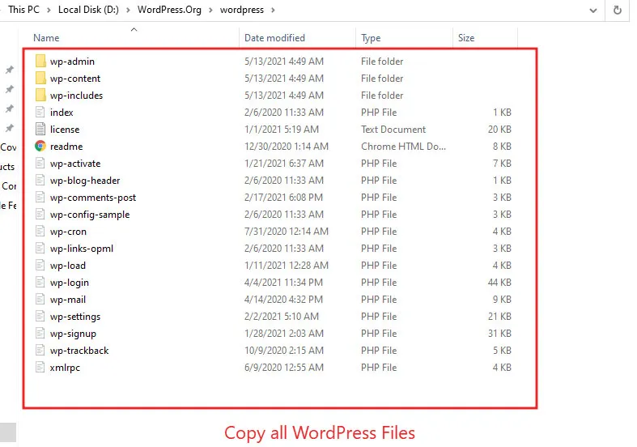
     
    2.2: Now, go to the XAMPP folder then find htdocs folder then open that folder.
     
    
     
    2.3: Now, create a folder named "wordpress" and copy all the files from the WordPress folder.
     
    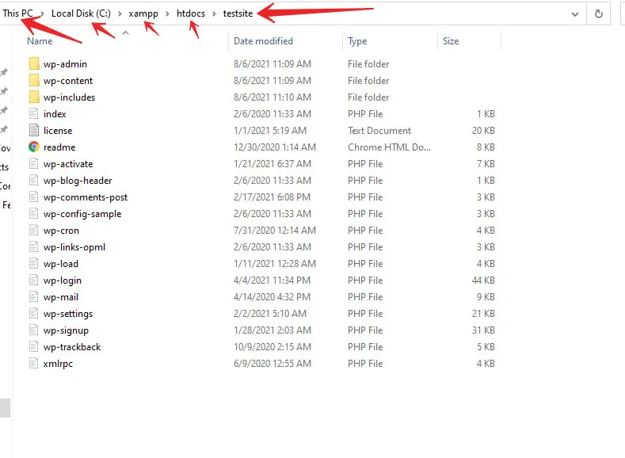
     
    2.4: Now, we have been placed WordPress files on the local XAMPP server. It’s time to access WordPress in our browser for installation and configuration.
     
    2.5: Open the browser and go to the localhost/wordpress folder. 
      
    <strong>Note:</strong> localhost means this computer and wordpress is the folder that we have been created already.
     
    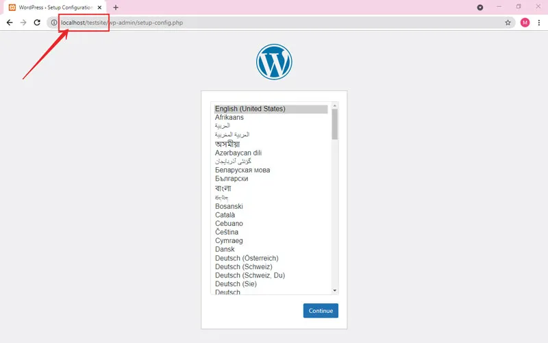
     
    2.6: After clicking on the continue button.
     
    
     
    2.7: Now, to install WordPress with XAMPP on localhost, we need a database.
     
    <h3>Step 3: Create a Database to install WordPress on localhost</h3>
     
    3.1: As you can see in the above image, it is asking for.
    <ul>
        <li><strong>Database name</strong></li>
        <li><strong>Username</strong></li>
        <li><strong>Password</strong></li>
        <li><strong>Database host</strong></li>
        <li><strong>Table prefix</strong></li>
    </ul>
     
    3.2: Now, open a new tab in your browser and type localhost/PHPMyAdmin. This will take us to the place where we will create a new database.
     
    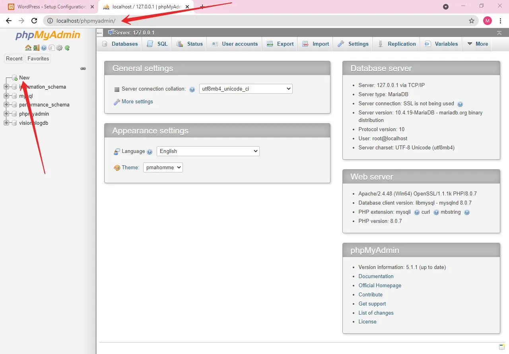
     
    3.3: Now, we will create a new database named wordpress.
     
    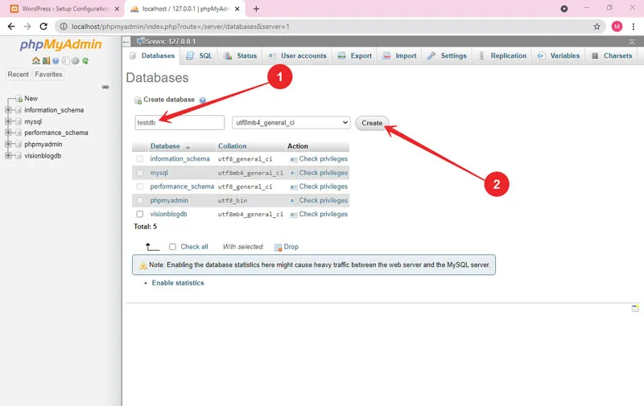
     
    <h3>Step 4: Configure and Install WordPress</h3>
     
    4.1: After that go to the WordPress setup configuration page and click on the <strong>let’s go</strong>button. As shown below.
     
    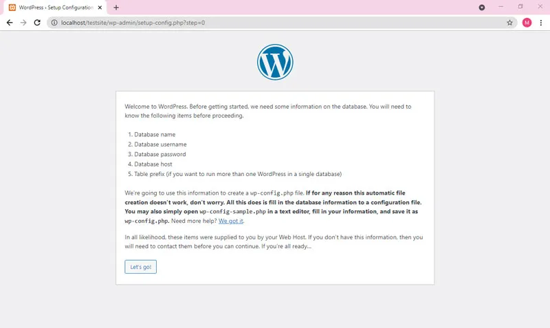
     
    4.2: Now, enter the <strong>database name</strong>, <strong>username</strong>, <strong>password</strong>, and <strong>hostname</strong>. Then click on submit button.
     
    
     
    4.3: Click on Run the installation.
     
    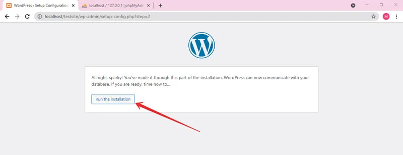
     
    4.4: Here you go. You will enter your new website details here. <strong>Site title</strong>, <strong>username</strong>, <strong>password</strong>, and <strong>correct email</strong> then click on install WordPress.
     
    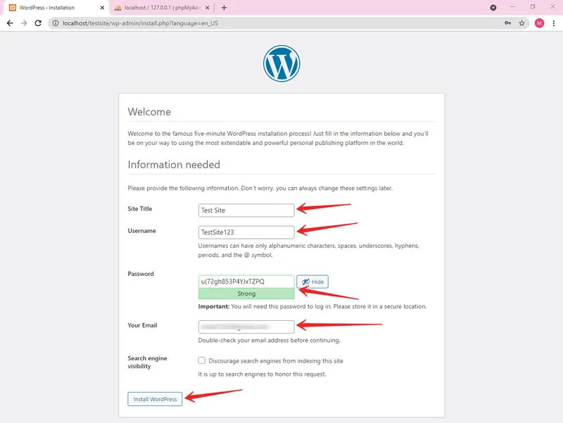
     
    <strong>Note:</strong> Remember your username and password because you will need that to log in to the WordPress website.
     
    WordPress will install in a minute. After that click on the login button.
     
    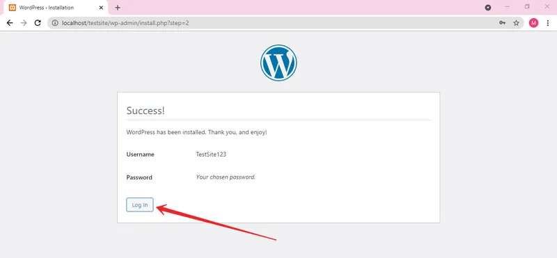
     
    4.5: Enter your login details and click login.
     
    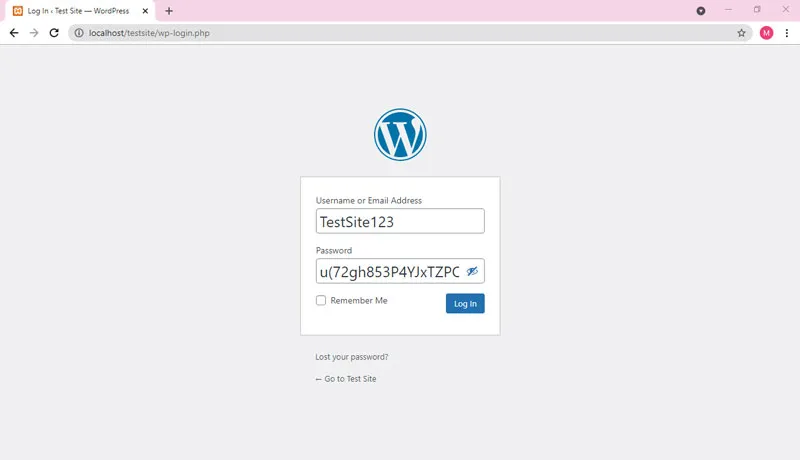
     
    4.6: After clicking on login, it will take you to the WordPress dashboard.
     
    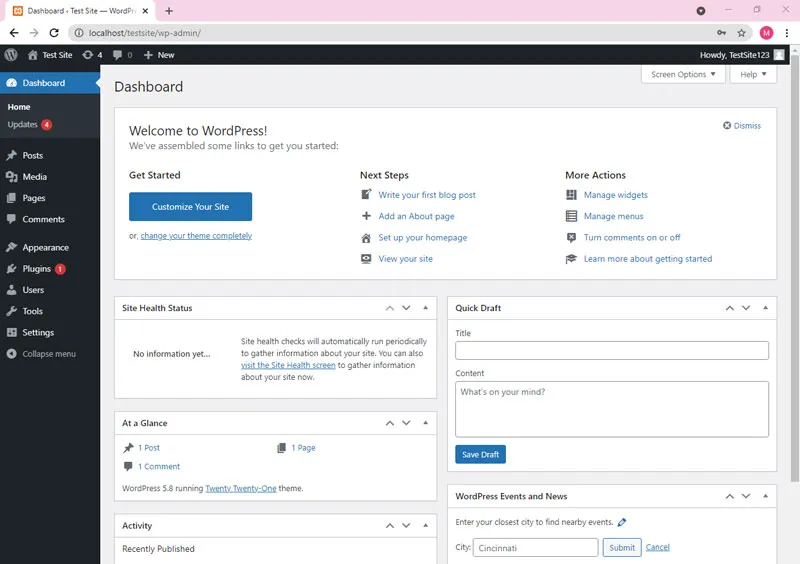
     
    <strong>Congratulations</strong>! We have installed WordPress on localhost.
     
    4.7: At the WordPress site, click on your site name to go to the site. In my case, I created this site with the Test Site name. So, I click on that. As shown in the image below.
     
    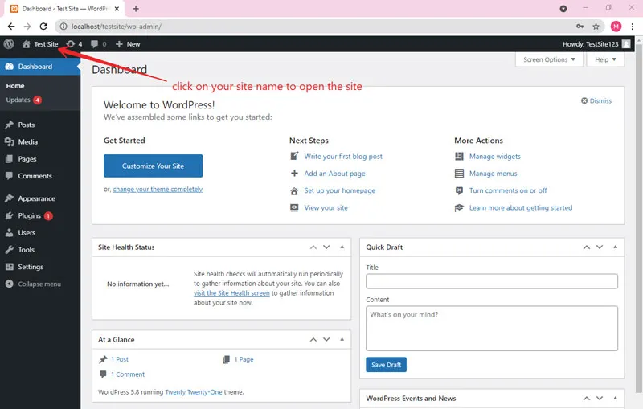
     
    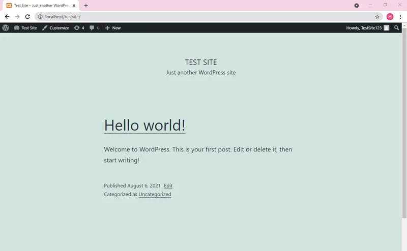
     
    By default, WordPress is using the 2021 theme.
     
    <strong>All Done!</strong> Congratulations you have installed WordPress on localhost with XAMPP.
     
    Now we have successfully installed WordPress on localhost. Now, you can customize your website as you want. Just remember these two points below.

